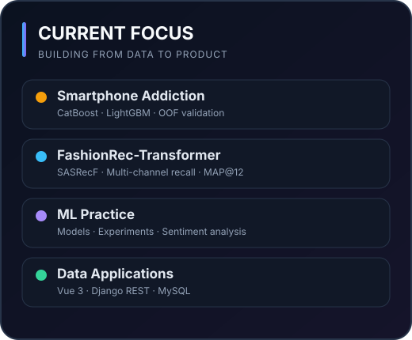
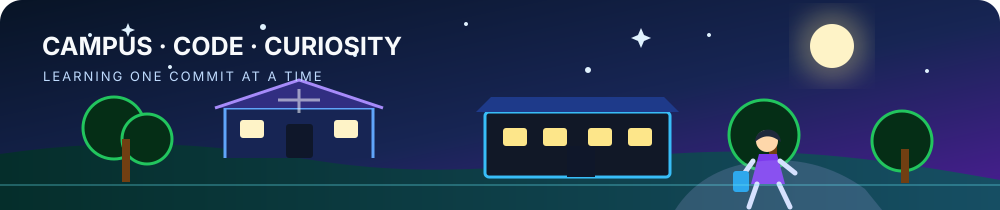
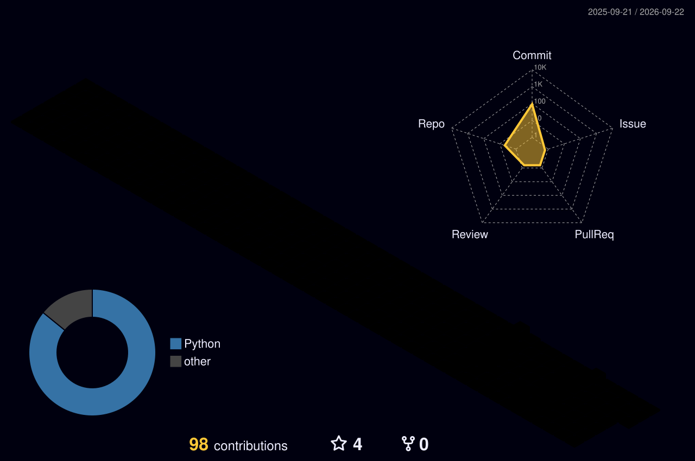

  

  
  
  
  

## About Me

<table>
  <tr>
    <td width="58%" valign="top">
      

        我是一名<strong>在读大学生</strong>，正在系统学习
        <strong>应用机器学习、推荐系统与全栈开发</strong>。
        我喜欢从数据和实验出发，把模型、后端服务与可交互产品连接起来，
        也在用项目记录自己的成长轨迹。
      

      <h3>What I Do</h3>
      <ul>
        <li>搭建可复现的表格分类、OOF 验证与模型融合流程。</li>
        <li>构建序列推荐、多路召回与离线评估流程。</li>
        <li>使用 Python 进行机器学习实验和数据处理。</li>
        <li>使用 Vue、Django REST Framework 与 MySQL 开发数据应用。</li>
      </ul>
      <h3>Currently Learning</h3>
      <ul>
        <li>Recommender Systems & Deep Learning</li>
        <li>Reliable experiment design and evaluation</li>
        <li>Turning models into usable products</li>
      </ul>
      <blockquote>Stay curious. Build things. Learn in public.</blockquote>
    </td>
    <td width="42%" valign="top">
      
    </td>
  </tr>
</table>

## Campus & Code

<table>
  <tr>
    <td width="50%" valign="top">
      <h3>🎓 Student Life</h3>
      
在课程、项目和竞赛之间持续积累，把每一次实验都变成可复用的经验。

    </td>
    <td width="50%" valign="top">
      <h3>🧠 Learning Focus</h3>
      
应用机器学习、推荐系统、模型评估，以及更可靠的实验设计。

    </td>
  </tr>
  <tr>
    <td width="50%" valign="top">
      <h3>🛠️ Building</h3>
      
可复现 ML 流程、数据应用、REST API，以及从模型到产品的完整链路。

    </td>
    <td width="50%" valign="top">
      <h3>🌱 Next Step</h3>
      
完成更多真实数据实验，参与开源协作，并持续改善工程质量。

    </td>
  </tr>
</table>

## Current Focus

  

## Featured Projects

<table>
  <tr>
    <td width="50%" valign="top">
      <h3><a href="https://github.com/Sunshine-1023/Predicting-Smartphone-Addiction">Predicting Smartphone Addiction</a></h3>
      
面向 Kaggle 表格二分类的可复现 ML 工程：CatBoost / LightGBM、分层 OOF、配置化实验、测试与 CI。

      
<code>Python</code> <code>CatBoost</code> <code>LightGBM</code> <code>ML Engineering</code>

    </td>
    <td width="50%" valign="top">
      <h3><a href="https://github.com/Sunshine-1023/asarec-pratice">FashionRec-Transformer</a></h3>
      
基于 H&amp;M 数据的时尚推荐系统：SASRecF + 四路召回融合，并以 MAP@12 进行离线评估。

      
<code>Python</code> <code>SASRecF</code> <code>RecBole</code> <code>Recommender Systems</code>

    </td>
  </tr>
  <tr>
    <td width="50%" valign="top">
      <h3><a href="https://github.com/Sunshine-1023/Petroleum-Plant-Data-Management-System">Well Cost Management</a></h3>
      
前后端分离的数据管理系统，覆盖 REST API、事务、存储过程、触发器与业务查询。

      
<code>Vue 3</code> <code>Django REST</code> <code>MySQL</code> <code>JavaScript</code>

    </td>
    <td width="50%" valign="top">
      <h3><a href="https://github.com/Sunshine-1023/ML-pratice">Machine Learning Practice</a></h3>
      
机器学习实践与实验集合，包含数据处理、模型训练和情感分析等练习。

      
<code>Python</code> <code>PyTorch</code> <code>Machine Learning</code>

    </td>
  </tr>
</table>

## Tech Stack

  
  
  
  
  
  
   
  
  
  
  
  
  
  

  

## GitHub Overview

  

<table>
  <tr>
    <td width="50%" align="center">
      
    </td>
    <td width="50%" align="center">
      
    </td>
  </tr>
</table>

  

<!-- 3D CONTRIBUTION START
## 3D Contribution

  

3D CONTRIBUTION END -->

  Thanks for visiting — welcome to follow an undergraduate student's learning and building journey.

