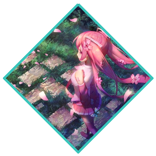
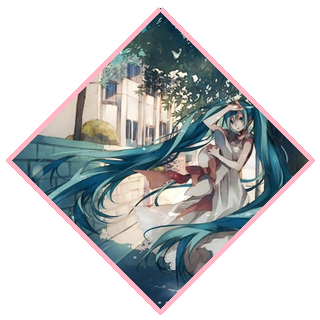
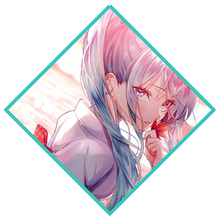
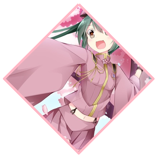
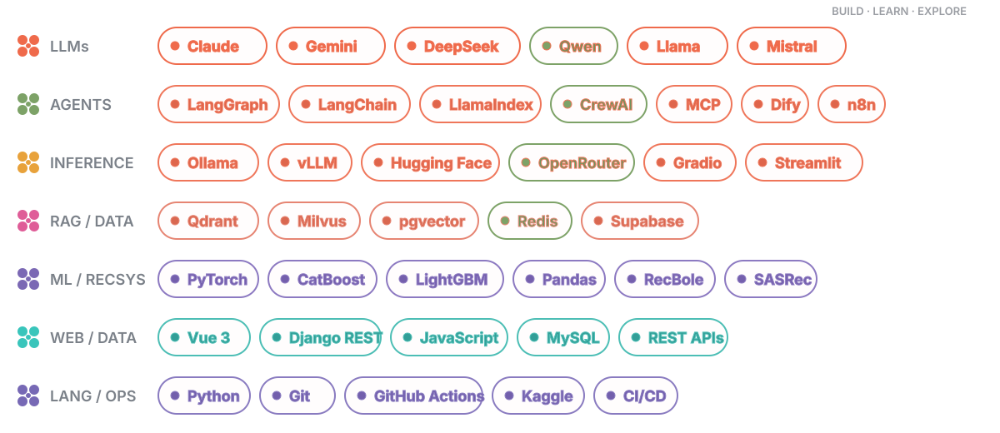
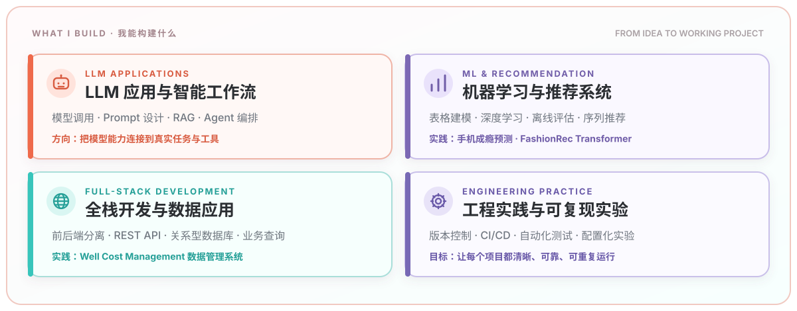
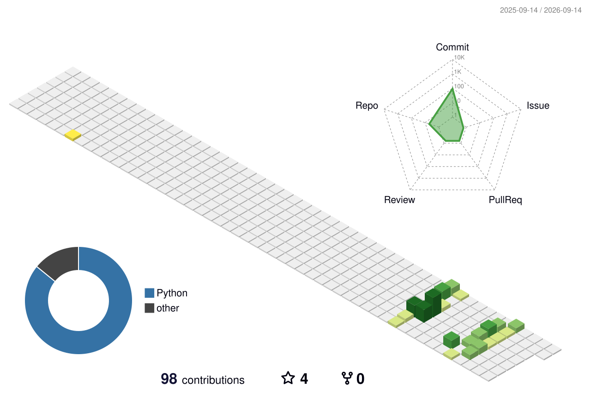

  

 

  
🌸 🌸 🌸 &nbsp; <b>🎨 初音画廊 · Miku Gallery</b> &nbsp; 🌸 🌸 🌸

  

    
    
    
    
    
  

  
🎵 &nbsp; 🎵 &nbsp; 🎵

 

  
  
  

  
  
  

 

<h2 align="center">About Me</h2>

  我是一名在读大学生，正在学习应用机器学习、推荐系统与全栈开发。 
  喜欢把数据、模型和工程实现连接起来，也用项目记录自己的成长。

  

    <b>Learning</b> &nbsp; Recommender Systems · Deep Learning · Reliable Evaluation 
    <b>Building</b> &nbsp; Reproducible ML Pipelines · Data Applications · REST APIs 
    <b>Exploring</b> &nbsp; Open Source · Kaggle · Model-to-Product Workflows
  

<i>Stay curious. Build things. Learn in public.</i>

<h2 align="center">LLM Ecosystem &amp; Tech Stack</h2>

  

  
<b>🌱 Field guide</b> — 点击收起或展开

   
  

    
  

<h2 align="center">Featured Projects</h2>

<table>
  <tr>
    <td width="50%" valign="top">
      <h3><a href="https://github.com/Sunshine-1023/Predicting-Smartphone-Addiction">Predicting Smartphone Addiction</a></h3>
      
面向 Kaggle 表格二分类的可复现机器学习工程，包含 CatBoost / LightGBM、分层 OOF、配置化实验、测试与 CI。

      
<code>Python</code> <code>CatBoost</code> <code>LightGBM</code> <code>ML Engineering</code>

    </td>
    <td width="50%" valign="top">
      <h3><a href="https://github.com/Sunshine-1023/asarec-pratice">FashionRec Transformer</a></h3>
      
基于 H&amp;M 数据的时尚推荐系统实践，使用 SASRecF 与四路召回融合，并以 MAP@12 进行离线评估。

      
<code>Python</code> <code>SASRecF</code> <code>RecBole</code> <code>Recommendation</code>

    </td>
  </tr>
  <tr>
    <td width="50%" valign="top">
      <h3><a href="https://github.com/Sunshine-1023/Petroleum-Plant-Data-Management-System">Well Cost Management</a></h3>
      
前后端分离的数据管理系统，覆盖 REST API、事务、存储过程、触发器与业务查询。

      
<code>Vue 3</code> <code>Django REST</code> <code>MySQL</code> <code>JavaScript</code>

    </td>
    <td width="50%" valign="top">
      <h3><a href="https://github.com/Sunshine-1023/ML-pratice">Machine Learning Practice</a></h3>
      
机器学习实践与实验集合，包含数据处理、模型训练、情感分析等练习。

      
<code>Python</code> <code>PyTorch</code> <code>Machine Learning</code>

    </td>
  </tr>
</table>

<h2 align="center">Contribution Garden</h2>

  

  

